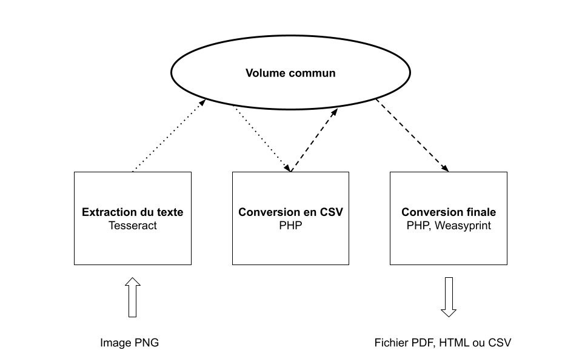

# Extraction de contacts à partir d'images

Troisième projet lors de la formation en BUT Informatique, j'ai réalisé avec mon équipe un système automatisé permettant d'extraire une liste de contacts pour une entreprise à partir de captures d'écrans ou de scans. Le système propose un rendu en HTML, en PDF ou en CSV.

## Technologies

Le projet utilise une suite de conteneurs **[Docker](https://www.docker.com/)**, qui permet de gérer des systèmes indépendants mais bien moins gourmands en ressources que des systèmes virtualisés. Chaque conteneur effectue une tâche simple et tous sont reliés à un volume commun, c'est-à-dire une zone de dépot de fichiers. Les conteneurs ont été préalablement conçus, nous n'avions plus qu'à les utiliser.

Le premier conteneur se sert de la technologie de reconnaissance de caractères de Google, **Tesseract OCR**, dans le but d'extraire les textes des captures d'écran. Ensuite, le deuxième conteneur entre en jeu et transforme ce résultat brut en un fichier CSV. Enfin, le dernier conteneur utilise un ensemble d'outils de conversion, dont **[Weasyprint](https://weasyprint.org/)** pour la conversion HTML vers PDF.

## Documentation

Pour plus d'informations sur le fonctionnement, regarder la [documentation](documentation.md)

## Équipe
 - Enzo MAROS (Chef de Projet)
 - Alexie GROSBOIS
 - Noah BROHAN
 - Ronan BRAGATO